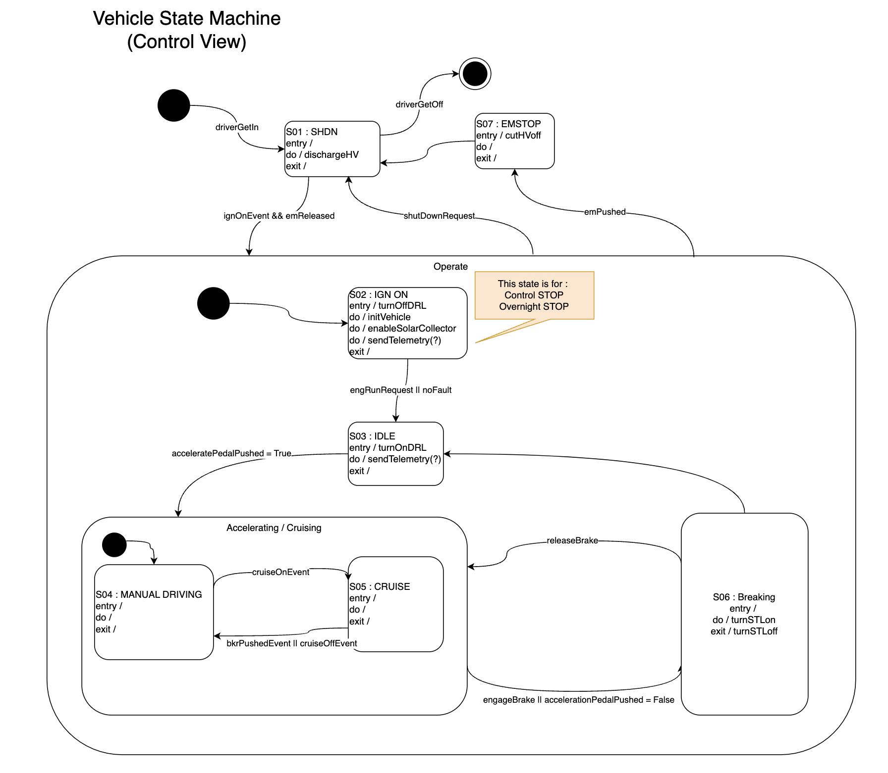

# EE-archiectural-design
 - Elecrical & Electronics architecural design
 - System decompositional view
 
 - Overall architectural design 

 - Data acquisition architecture

 - Vehicle State
 

# EE Doc Folder structure
 - EE Architectural Design
 - EE Detailed Design